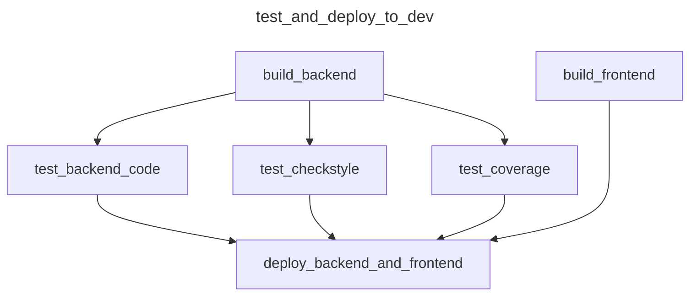
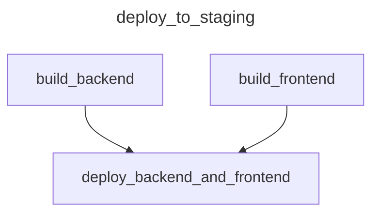
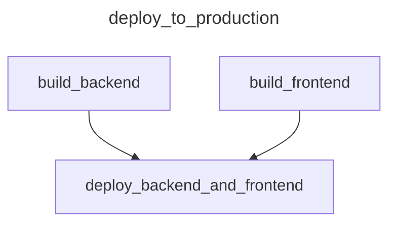

# CircleCI

<!-- TOC -->
* [CircleCI](#circleci)
  * [Audience](#audience)
  * [Scope](#scope)
  * [Documentation](#documentation)
    * [CircleCI pipeline configuration](#circleci-pipeline-configuration)
      * [Triggering CircleCI pipeline](#triggering-circleci-pipeline)
      * [CircleCI workflows](#circleci-workflows)
      * [CircleCI jobs](#circleci-jobs)
      * [Behaviour of CircleCI pipeline workflows](#behaviour-of-circleci-pipeline-workflows)
    * [Setting up CircleCI pipeline](#setting-up-circleci-pipeline)
    * [Setting up CircleCI project](#setting-up-circleci-project)
      * [Setting up under an existing CircleCI organization](#setting-up-under-an-existing-circleci-organization)
      * [Setting up under an existing CircleCI organization](#setting-up-under-an-existing-circleci-organization-1)
    * [Set up CircleCI pipeline](#set-up-circleci-pipeline)
    * [Define Committed application environmental variables](#define-committed-application-environmental-variables)
    * [Define Committed application EC2 instances credentials](#define-committed-application-ec2-instances-credentials)
<!-- TOC -->

## Audience

This document is intended for a _software developer_ **not** familiar with _[^CircleCI]_
_[^pipeline]_ tasked with set-up of a configured _pipeline_ for a _Committed_ project.

You require the "_Committed_ project: Infrastructure" documentation to be able to finish the
CircleCi pipeline set-up.

## Scope

This document describes the overall [^workflow] and a set-up of a configured _CircleCi pipeline_ for
a _Committed_ project.

This document does not describe how to configure a _CircleCi pipeline_, nor it explains how this
particular _pipeline_ works in detail.

[^circleCI]: https://developers.google.com/tech-writing/one/documents

[^pipeline]: https://developers.google.com/tech-writing/one/documents

[^workflow]: https://developers.google.com/tech-writing/one/documents

## Documentation

### CircleCI pipeline configuration

#### Triggering CircleCI pipeline

The CircleCI pipeline are triggered by one of the following events:

+ Triggering it manually using the CircleCI web application.
+ Opening a [^pull request] using GitHub.
+ Pushing a commit to GitHub to one of the following branches:
  + a [^default branch]
  + a branch with an associated [^pull request]

#### CircleCI workflows

The Committed project CircleCI pipeline has the following workflows configured:

+ `test_and_deploy_to_dev`
+ `deploy_to_staging`
+ `deploy_to_production`

The individual CircleCI workflows consist of CircleCI jobs and are associated witch Git branches, and deployment environments according to the
following table:

| Workflow name            | Jobs                                                                                                                                | Associated branch | Associated environment |
|--------------------------|-------------------------------------------------------------------------------------------------------------------------------------|-------------------|------------------------|
| `deploy_to_production`   | `build_backend` `build_frontend` `deploy_backend_and_frontend`                                                                | `main`            | `production`           |
| `deploy_to_staging`      | `build_backend` `build_frontend` `deploy_backend_and_frontend`                                                                | `develop`         | `staging`              |
| `test_and_deploy_to_dev` | `build_backend` `build_frontend` `test_backend_code` `test_checkstyle` `test_coverage` `deploy_backend_and_frontend` | any other         | `dev`                  |

#### CircleCI jobs

The CircleCI jobs perform the following tasks:

+ `build_backend` builds a Java (backend) part
+ `build_frontend` builds a React (frontend) part
+ `test_backend_code` tests the Java code
+ `test_checkstyle` checks the Java code style
+ `test_coverage` checks the Java code test coverage
+ `deploy_backend_and_frontend` deploys the Committed application

#### Behaviour of CircleCI pipeline workflows

The jobs depend one on another according to the following diagram:

### Setting up CircleCI pipeline

To set up a CircleCI project you must follow these steps:

1. Set up CircleCI project.
2. Set up CircleCI pipeline.
3. Define Committed application environmental variables.
4. Define Committed application EC2 instances credentials.

### Setting up CircleCI project

There are two ways how to set up a CicleCi pipeline:

+ under an existing CircleCI organization
+ under a new CircleCI organization

#### Setting up under an existing CircleCI organization

+ @formatter:off
1. [Sign up](https://circleci.com/signup/) or [sign in](https://circleci.com/vcs-authorize/) to a personal account in [CircleCI web application](https://app.circleci.com/dashboard).
2. Connect the CircleCI web application to the GitHub repository (by continuing the wizard):
   1. Select `green-fox-academy` GitHub organization.
   2. Install & Authorize CircleCI App to `simensis-osic-devops-zwei` repository. ()
3. Create a project (by continuing the wizard or using a [link](https://app.circleci.com/projects/create-project/)).
@formatter:on

#### Setting up under an existing CircleCI organization

@formatter:off
1. Follow the link from an invitation email. (Do not attempt to sign up directly from the Sign Up page!).
2. Connect the CircleCI web application to the GitHub repository (by continuing the wizard):
   1. Select `green-fox-academy` GitHub organization.
   2. Install & Authorize CircleCI App to `simensis-osic-devops-zwei` repository. ()
3. Create a project (by continuing the wizard or using a [link](https://app.circleci.com/projects/create-project/)).
@formatter:on

### Set up CircleCI pipeline

1. Add environment variables listed in the following table to the CircleCI project:
   @formatter:off

| Name                    | Reference                                                             | Requirements |
|-------------------------|-----------------------------------------------------------------------|--------------|
| `AWS_ACCESS_KEY_ID`     | [Committed project: Infrastructure documentation][1] AWS AIM User     | Access:      |
| `AWS_SECRET_ACCESS_KEY` | [Committed project: Infrastructure documentation][1] AWS AIM User     |              |
| `AWS_DEFAULT_REGION`    | [Committed project: Infrastructure documentation][1] AWS              |              |
| `CIRCLECI_API_TOKEN`    | `CircleCI > Project Settings > API Permissions > Add API Token`       |              |
| `DISCORD_WEBHOOK_URL`   | `Discord > Discord Group > Server Settings > Integrations > Webhooks` | Scope: Admin |
@formatter:on

2. Add AWS EC2 SHH key to the CircleCI project
   under `CircleCI > Project Settings > SSH Keys > Additional SSH Keys > Add SSH key`
   referring to [Committed project: Infrastructure documentation][1].
3. Configure CircleCi organization's security settings
   referring to `CircleCI > Organization Settings > Security > Orb Security Settings > Yes`
4. Configure CircleCi project to build only pull requests
   referring to `CircleCI > Project Settings > Advanced > Only build pull requests > On`

### Define Committed application environmental variables

1. Connect to a Committed Project Git repository.
2. Connect to AWS S3 bucket[1].
3. Copy file `.env.sample` from the Git repository to the S3 bucket
   filepath `s3://committed-todo-app/envs/.env.{environment}` where `environment` is one
   of `env`. `staging` or `production`.
4. Set the variables to the desired values and save the file.

### Define Committed application EC2 instances credentials

1. Connect to a Committed Project Git repository.
2. Connect to AWS S3 bucket[1].
3. Copy file `.env.ec2` from the Git repository to the S3 bucket
   filepath `s3://committed-todo-app/envs/.env.ec2`.
4. Set the variables to the appropriate values and save the file.

[1]: add a link
[//]: # (TODO)

[^default branch]: https://docs.github.com/en/repositories/configuring-branches-and-merges-in-your-repository/managing-branches-in-your-repository/changing-the-default-branch
[^pull request]: https://docs.github.com/en/pull-requests/collaborating-with-pull-requests/proposing-changes-to-your-work-with-pull-requests/about-pull-requests
