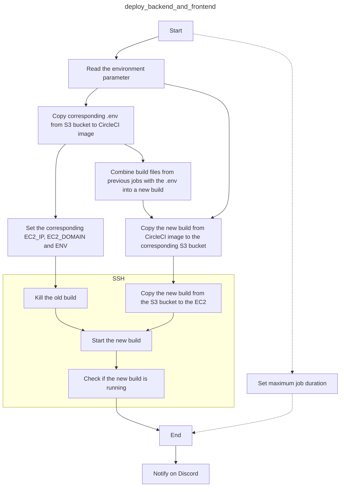

# CircleCI Documentation

<!-- TOC -->
* [CircleCI Documentation](#circleci-documentation)
  * [About this document](#about-this-document)
    * [Audience](#audience)
    * [Scope](#scope)
    * [Prerequisites](#prerequisites)
  * [CircleCI pipeline configuration](#circleci-pipeline-configuration)
    * [Triggering CircleCI pipeline](#triggering-circleci-pipeline)
    * [CircleCI workflows](#circleci-workflows)
    * [Workflows configuration](#workflows-configuration)
    * [CircleCI jobs](#circleci-jobs)
  * [Enabling CircleCI pipeline](#enabling-circleci-pipeline)
    * [Setting up CircleCI project](#setting-up-circleci-project)
      * [Setting up CircleCI project under a new CircleCI organization](#setting-up-circleci-project-under-a-new-circleci-organization)
      * [Setting up CircleCI project under an existing CircleCI organization](#setting-up-circleci-project-under-an-existing-circleci-organization)
    * [Setting up CircleCI pipeline](#setting-up-circleci-pipeline)
    * [Defining Committed application environmental variables](#defining-committed-application-environmental-variables)
    * [Defining Committed application EC2 instances credentials](#defining-committed-application-ec2-instances-credentials)
<!-- TOC -->

## About this document

### Audience

This document is intended for a software developer not familiar with [^CircleCI]
[^pipeline] tasked with set-up of a configured pipeline for a Committed project.

### Scope

This document describes the overall [^workflow] and a set-up of a configured _CircleCi pipeline_ for
a _Committed_ project.

This document does not describe how to configure a _CircleCi pipeline_, nor it explains how this
particular _pipeline_ works in detail.

### Prerequisites

This document depends on [^Committed project: Infrastructure documentation] for the set-up of the
CircleCi pipeline.

## CircleCI pipeline configuration

### Triggering CircleCI pipeline

The CircleCI pipeline are triggered by one of the following events:

+ Triggering it manually using the CircleCI web application.
+ Opening a [^pull request] using GitHub.
+ Pushing a commit to GitHub to one of the following branches:
  + a [^default branch]
  + a branch with an associated [^pull request]

### CircleCI workflows

The Committed project CircleCI pipeline has the following workflows configured:

+ `test_and_deploy_to_dev`
+ `deploy_to_staging`
+ `deploy_to_production`

### Workflows configuration

The workflows are associated witch Git branches and deployment environments according to the
following table:

| Workflow name            | Associated branch | Associated environment |
|--------------------------|-------------------|------------------------|
| `deploy_to_production`   | `main`            | `production`           |
| `deploy_to_staging`      | `develop`         | `staging`              |
| `test_and_deploy_to_dev` | any other         | `dev`                  |

The workflows consist of jobs that depend one on another according to the following diagram:

### CircleCI jobs

Each workflow consist of several jobs. The jobs perform the following tasks:

+ `build_backend` builds a Java (backend) part
+ `build_frontend` builds a React (frontend) part
+ `test_backend_code` tests the Java code
+ `test_checkstyle` checks the Java code style
+ `test_coverage` checks the Java code test coverage
+ `deploy_backend_and_frontend` deploys the Committed application

The most complicated job is the `deploy_backend_and_frontend` job. It consists of many consecutive
steps. The logic, in fact, can be better represented in parallel with the following diagram:

## Enabling CircleCI pipeline

To enable a CircleCI pipeline you must follow these steps:

+ Set up CircleCI project.
+ Set up CircleCI pipeline.
+ Define Committed application environmental variables.
+ Define Committed application EC2 instances credentials.

### Setting up CircleCI project

There are two ways how to set up a CircleCi pipeline:

+ under an existing CircleCI organization
+ under a new CircleCI organization

#### Setting up CircleCI project under a new CircleCI organization

1. [Sign up](https://circleci.com/signup/) or [sign in](https://circleci.com/vcs-authorize/) to a personal account in [CircleCI web application](https://app.circleci.com/dashboard).
2. Connect the CircleCI web application to the GitHub repository (by continuing the wizard):
   1. Select `green-fox-academy` GitHub organization.
   2. Install & Authorize CircleCI App to `simensis-osic-devops-zwei` repository. ()
3. Create a project (by continuing the wizard or using a [link](https://app.circleci.com/projects/create-project/)).

#### Setting up CircleCI project under an existing CircleCI organization

1. Follow the link from an invitation email. (Do not attempt to sign up directly from the Sign Up page!).
2. Connect the CircleCI web application to the GitHub repository (by continuing the wizard):
   1. Select `green-fox-academy` GitHub organization.
   2. Install & Authorize CircleCI App to `simensis-osic-devops-zwei` repository. ()
3. Create a project (by continuing the wizard or using a [link](https://app.circleci.com/projects/create-project/)).

### Setting up CircleCI pipeline

1. Add environment variables listed in the following table to the CircleCI project:

| Name                    | Reference                                                             | Requirements |
|-------------------------|-----------------------------------------------------------------------|--------------|
| `AWS_ACCESS_KEY_ID`     | [^Committed project: Infrastructure documentation] AWS AIM User       | Access:      |
| `AWS_SECRET_ACCESS_KEY` | [^Committed project: Infrastructure documentation] AWS AIM User       |              |
| `AWS_DEFAULT_REGION`    | [^Committed project: Infrastructure documentation] AWS                |              |
| `CIRCLECI_API_TOKEN`    | `CircleCI > Project Settings > API Permissions > Add API Token`       |              |
| `DISCORD_WEBHOOK_URL`   | `Discord > Discord Group > Server Settings > Integrations > Webhooks` | Scope: Admin |

2. Add AWS EC2 SHH key to the CircleCI project
   under `CircleCI > Project Settings > SSH Keys > Additional SSH Keys > Add SSH key`.
3. Configure CircleCi organization's security settings
   under `CircleCI > Organization Settings > Security > Orb Security Settings > Yes`.
4. Configure CircleCi project to build only pull requests
   under `CircleCI > Project Settings > Advanced > Only build pull requests > On`.

### Defining Committed application environmental variables

1. Connect to a Committed Project Git repository.
2. Connect to AWS S3 bucket.
3. Copy file `.env.sample` from the Git repository to the S3 bucket
   filepath `s3://committed-todo-app/envs/.env.{environment}` where `environment` is one
   of `env`. `staging` or `production`.
4. Set the variables to the desired values and save the file.

### Defining Committed application EC2 instances credentials

1. Connect to a Committed Project Git repository.
2. Connect to AWS S3 bucket.
3. Copy file `.env.ec2` from the Git repository to the S3 bucket
   filepath `s3://committed-todo-app/envs/.env.ec2`.
4. Set the variables to the appropriate values and save the file.

[^circleCI]: https://circleci.com/
[^pipeline]: https://circleci.com/docs/pipelines/
[^workflow]: https://circleci.com/docs/workflows/
[^default branch]: https://docs.github.com/en/repositories/configuring-branches-and-merges-in-your-repository/managing-branches-in-your-repository/changing-the-default-branch
[^pull request]: https://docs.github.com/en/pull-requests/collaborating-with-pull-requests/proposing-changes-to-your-work-with-pull-requests/about-pull-requests
[^Committed project: Infrastructure documentation]:
