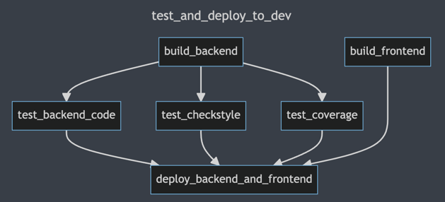
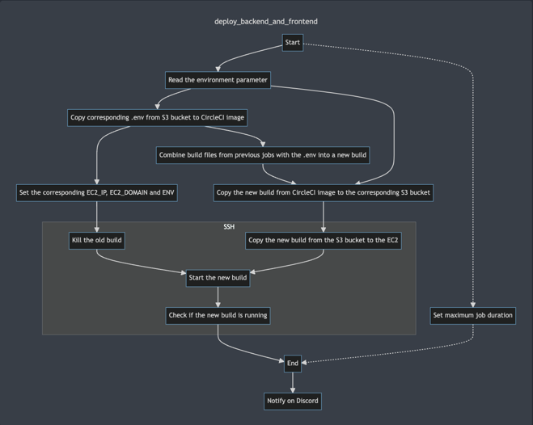

<!-- TOC -->
* [About the presentation](#about-the-presentation)
  * [Scope](#scope)
  * [Public](#public)
* [Presentation](#presentation)
  * [Personal Introduction](#personal-introduction)
    * [slide](#slide)
    * [notes](#notes)
        * [past](#past)
        * [present](#present)
        * [future](#future)
  * [Tech Stack](#tech-stack)
    * [slide](#slide-1)
    * [note](#note)
        * [Backend](#backend)
        * [DevOps](#devops)
  * [CircleCI tricks](#circleci-tricks)
    * [slide](#slide-2)
      * [custom timeout job](#custom-timeout-job)
      * [env parameter](#env-parameter)
      * [exec and check](#exec-and-check)
    * [note](#note-1)
<!-- TOC -->

# About the presentation

## Scope

A 4 minute! presentation about me and my work on our project consisting of the following:

1. init the presentation (start of the sketch, hand over the word from Daniel)
2. short introduction (30" to 60")
   + past
   + present
   + future
3. Sum up everything what I have learned / done during the project (as a part of the intro above?)
4. Show examples from my work on one (max two tasks)

## Public

Hiring agents and **line managers** from IT companies including ones from abroad.

# Presentation

---

## Personal Introduction

### slide

lab photo

### note

> Aaaah already Daniel? Let me quickly finish something..._git push --force_ (whispering) :-)

...where was I..let me start again...Hello everybody, my name is Matej.

##### past

Until recently I worked as a synthetic chemist. While working, mostly in research, I became more and
more interested in IT.

##### present

That eventually brought me **here**. So far I **enjoy** the endless opportunities to **think**, *
*learn**,
and **solve** problems.

> And sometimes also make new ones, but that's another story :-)

##### future

In the near future I hope to find a job in **DevOps** or **Backend** **development** and I wouldn't
even mind a little bit of frontend.

> but just a little bit :-)

## Tech Stack

### slide

+ Java
+ Spring Boot
   + Spring Security
   + JWT
+ Flyway
   + MySql
   + Java
+ Postman
   + JS tests
+ AWS
   + Console
   + EB
   + CLI
+ Docker (containerization and deployment of the Backend)
+ CircleCI
+ Bash

_some funny picture for these two sections:_

+ Backend
+ DevOps

_being stuck in a circle meme_

### note

##### Backend

~~Naturally I did all the work on Backend part in **IntelliJ** **IDEA** using **Java**. While
working
on the Backend, I configured the **Spring Security** for use with **JWT** **tokens**. Besides that I
have also implemented the **Flyway** DB migration both in the form of **Java**
and **MySQL** **scripts**.
I have implemented a configurable **pagination** and I also got familiar with
the **internationalisation**.~~

While working on the _Backend_ of our **project** I have implemented the **Flyway** DB migration
both in the form of
**Java** amd **MySQL** **scripts**. In addition to that I have also implemented a configurable
**pagination** and got familiar with **internationalisation**. But IMHO the biggest task of those  
was the configuration of **Spring Security** with (stateless) **JWT** **token** **authorization**.
Naturally I did all of that while working with **IntelliJ** **IDE**(A) using **Java** and **Git**.

##### DevOps

Later, while working on the _DevOvs_ part, I implemented a **circleCI** _continuous deployment_ 
to **AWS** **S3** and **EC2**.
> Between us: I don't know how they had come with the **name**, but thanks to recurring **changes** 
> in the **deployments** I really felt like being stuck in a circle :-)

Jokes aside, the good part was that I was able to get really familiar with it. And I have
learned a bit of **shell** along the way, which I think is going to pay of in the future.

## CircleCI tricks

### slide




#### custom timeout job

```yml
      - run:
          name: Set maximum job duration to 3'
          background: true
          command: |
            sleep 180
            curl --request POST \
            --url https://circleci.com/api/v2/project/gh/$CIRCLE_PROJECT_USERNAME/$CIRCLE_PROJECT_REPONAME/job/$CIRCLE_BUILD_NUM/cancel \
            --header "Circle-Token: $CIRCLECI_API_TOKEN"
```

#### env parameter

```yml
jobs:
  #...
  deploy_job:
    parameters:
      env:
        description: Environment suffix you want to deploy to.
        type: enum
        enum: ["dev", "staging", "production"]
        default: "dev"
  #...
```
```yml
workflows:
  deploy_to_staging:
    when:
      equal: [ develop, << pipeline.git.branch >> ]
    jobs:
      - build_backend
      - build_frontend:
          env: &staging_environment staging
      - deploy_backend_and_frontend:
          name: deploy to staging environment
          requires:
            - build_backend
            - build_frontend
          env: *staging_environment
```
```yml
      - run:
          name: Export the actual EC2_IP_{env}
          command: |
            set -a && source <(grep -v ^# .env.ec2) && set +a && echo export EC2_IP=$(circleci env subst "$EC2_IP_<<parameters.env>>") >> $BASH_ENV
            echo export EC2_HOST=$(circleci env subst "$EC2_DOMAIN_<<parameters.env>>")/ >> $BASH_ENV
            echo export EC2_USER=$EC2_USER >> $BASH_ENV
            echo export ENV=$(echo <<parameters.env>> | perl -ne 'print uc') >> $BASH_ENV
```

#### execute java and check pid

```yml
      - run:
          name: Set VARs and execute the jar
          command: ssh ${EC2_USER}@${EC2_IP} "set -a && source <(grep -v ^# build/${DOT_ENV_NAME}) && set +a && export EC2_HOST=${EC2_HOST} && export ENV=$ENV && env && echo \${$} > app.pid && exec java -jar build/api/${JAR_NAME}" & sleep 20
      - run:
          name: Check running java instance
          command: ssh ${EC2_USER}@${EC2_IP} "cat app.pid | xargs ps"
```

#### notify

```yml
      - discord/notify:
          success_message: ":tada: Hurray, ${CIRCLE_BUILD_URL} pipeline has succeeded! Check the webpage here: **http://${EC2_HOST}** or login here: **\\`ssh ${EC2_USER}@${EC2_IP}\\`**"
          failure_message: ":red_circle: We have to repair it :-( You can login into the server using this: **ssh ${EC2_USER}@${EC2_IP}**"
```
### note

That bring me to what I would like to show you now. I have picked a couple of interesting solutions
> from **Stackoverflow** I MEAN my **own configuration**.
