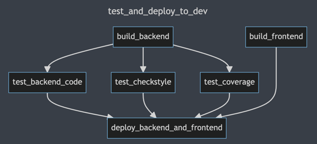

<!-- TOC -->

* [About the presentation](#about-the-presentation)
   * [Scope](#scope)
   * [Public](#public)
* [Presentation](#presentation)
   * [Personal Introduction](#personal-introduction)
      * [slide](#slide)
         * [notes](#notes)
            * [past](#past)
            * [present](#present)
            * [future](#future)
   * [Tech Stack](#tech-stack)
      * [slide](#slide-1)
         * [notes](#notes-1)
            * [Backend](#backend)
            * [DevOps](#devops)

<!-- TOC -->

# About the presentation

## Scope

A 4 minute! presentation about me and my work on our project consisting of the following:

1. init the presentation (start of the sketch, hand over the word from Daniel)
2. short introduction (30" to 60")
   + past
   + present
   + future
3. Sum up everything what I have learned / done during the project (as a part of the intro above?)
4. Show examples from my work on one (max two tasks)

## Public

Hiring agents and **line managers** from IT companies including ones from abroad.

# Presentation

---

## Personal Introduction

### slide

lab photo

#### notes

> Aaaah already Daniel? Let me quickly finish something..._git push --force_ (whispering) :-)

...where was I..let me start again...Hello everybody, my name is Matej.

##### past

Until recently I worked as a synthetic chemist. While working, mostly in research, I became more and
more interested in IT.

##### present

That eventually brought me **here**. So far I **enjoy** the endless opportunities to **think**, *
*learn**,
and **solve** problems.

> And sometimes also make new ones, but that's another story :-)

##### future

In the near future I hope to find a job in **DevOps** or **Backend** **development** and I wouldn't
even mind a little bit of frontend.

> but just a little bit :-)

## Tech Stack

### slide

+ Java
+ Spring Boot
   + Spring Security
   + JWT
+ Flyway
   + MySql
   + Java
+ Postman
   + JS tests
+ AWS
   + Console
   + EB
   + CLI
+ Docker (containerization and deployment of the Backend)
+ CircleCI
+ Bash

_some funny picture for these two sections:_

+ Backend
+ DevOps

_being stuck in a circle meme_

#### note

##### Backend

~~Naturally I did all the work on Backend part in **IntelliJ** **IDEA** using **Java**. While
working
on the Backend, I configured the **Spring Security** for use with **JWT** **tokens**. Besides that I
have also implemented the **Flyway** DB migration both in the form of **Java**
and **MySQL** **scripts**.
I have implemented a configurable **pagination** and I also got familiar with
the **internationalisation**.~~

While working on the _Backend_ of our **project** I have implemented the **Flyway** DB migration
both in the form of
**Java** amd **MySQL** **scripts**. In addition to that I have also implemented a configurable
**pagination** and got familiar with **internationalisation**. But IMHO the biggest task of those  
was the configuration of **Spring Security** with (stateless) **JWT** **token** **authorization**.
Naturally I did all of that while working with **IntelliJ** **IDE**(A) using **Java** and **Git**.

##### DevOps

Later, while working on the _DevOvs_ part, I implemented a **circleCI** _continuous deployment_*
*pipeline**.
> Between us: I don't know how they had come with the **name**, but thanks to recurring **changes** 
> in the **deployments** I really felt like being stuck in a circle :-)

Jokes aside, the good part was that I was able to get really familiar with it. And I have
learned a bit of **shell** along the way, which I think is going to pay of in the future.

## CircleCI tricks

### slide

#### note

That bring me to what I would like to show you now. I have picked a couple of interesting solutions
> from **Stackoverflow** I MEAN my **own configuration**.

